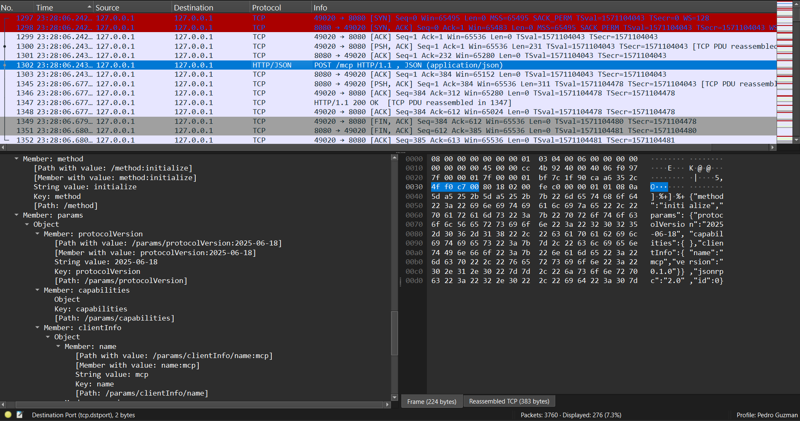
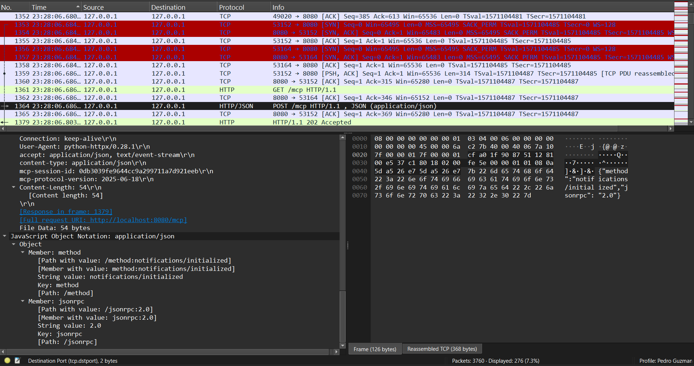
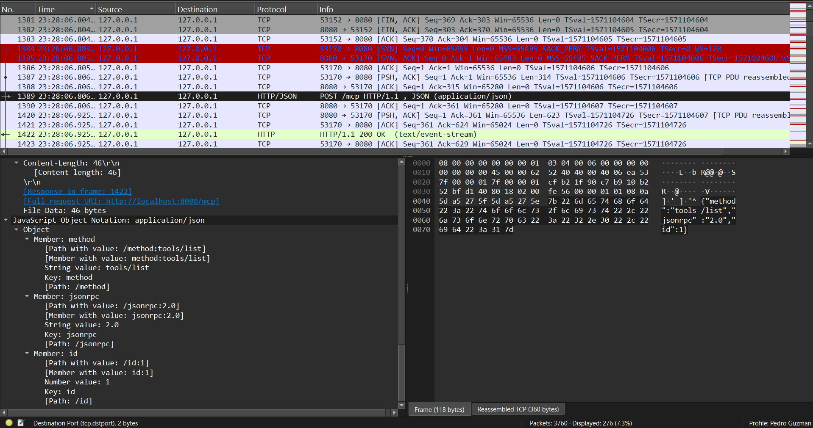
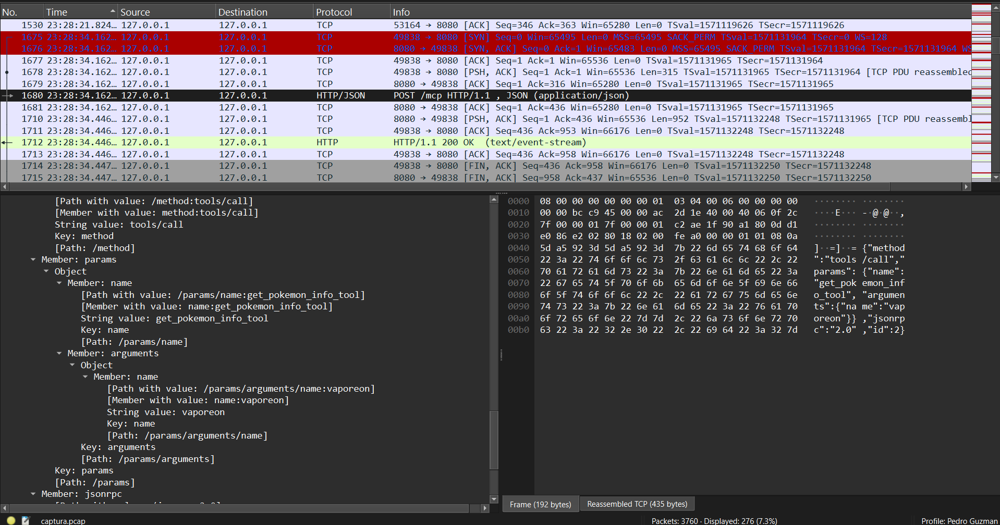

# Proyecto # 1: Implementación de un protocolo existente

En este proyecto se hace la implementación del protocolo MCP. Para ello, se usaron estos componentes:

- Un chatbot que utliza la API de un LLM existente 
- Un servidor MCP que corre de forma local en la máquina del usuario
- Un servidor MCP que corre de forma remota en un servicio de la nube

---

## Documentación y funcionamiento de los servidores MCP

## Servidor local

Este servidor utiliza la API de Spotify para coenctarse a la cueta del usuario y realizar operaciones como obtener las canciones o artistas más escuchados por el usuario en cierto periodo de tiempo, también es capaz de analizar las canciones guardadas por el usuario y crear playlists con recomendaciones en base a los gustos del usuario. Las intrucciones de instalación pueden encontrarse en: [Mcp server](https://github.com/PedroPabloGuzmanMayen/MCP_server)

### Documentación

#### Archivos Principales

- **`src/main.ts`**: Servidor MCP principal con definición de herramientas
- **`src/spotify.ts`**: Funciones de integración con la API de Spotify
- **`src/auth.ts`**: Servidor de autenticación OAuth 2.0 con PKCE


#### Especificación del Servidor MCP

##### Información del Servidor

- **Nombre**: `Spotiyou`
- **Versión**: `1.0.0`
- **Protocolo**: MCP (Model Context Protocol)
- **Transporte**: StdioServerTransport

#### Herramientas Disponibles

#### 1. Get_user_tracks
**Descripción**: Obtiene las canciones guardadas del usuario

**Parámetros**:
- `limit` (number): Número máximo de canciones a obtener
- `offset` (number): Número de canciones a omitir desde el inicio

**Respuesta**:
```json
{
  "items": [
    {
      "name": "Nombre de la canción",
      "artist": "Artista(s)",
      "album": "Nombre del álbum",
      "added_at": "2024-01-01T00:00:00Z"
    }
  ],
  "total_songs": 150
}
```

#### 2. Get_user_top_items_in_spotify
**Descripción**: Obtiene las canciones o artistas más escuchados por el usuario

**Parámetros**:
- `type` (enum): `"tracks"` | `"artists"` - Tipo de elemento a obtener
- `time_range` (enum): `"long_term"` | `"medium_term"` | `"short_term"` - Período de tiempo
- `offset` (number): Desplazamiento en la lista
- `limit` (number): Límite de elementos a obtener

**Respuesta para artistas**:
```json
[
  {
    "name": "Nombre del artista",
    "genres": ["rock", "alternative"]
  }
]
```

**Respuesta para canciones**:
```json
[
  {
    "name": "Nombre de la canción"
  }
]
```

#### 3. Search_something
**Descripción**: Busca una canción específica y obtiene su ID de Spotify

**Parámetros**:
- `song_name` (string): Nombre de la canción
- `artist` (string): Artista de la canción

**Respuesta**:
```
"spotify_track_id"
```

#### 4. Add_to_saved
**Descripción**: Guarda canciones en la biblioteca personal del usuario

**Parámetros**:
- `songs` (array[string]): Array de IDs de canciones de Spotify

**Respuesta**:
```
"true" | "false"
```

#### 5. Search_user_id
**Descripción**: Obtiene el ID del usuario actual

**Parámetros**: Ninguno

**Respuesta**:
```json
{
  "user_id": "spotify_user_id",
  "success": true
}
```

#### 6. Create_playlist
**Descripción**: Crea una nueva playlist para el usuario

**Parámetros**:
- `user_id` (string): ID del usuario
- `name` (string): Nombre de la playlist
- `visibility` (boolean): Si la playlist es pública (por defecto: false)
- `collaborative` (boolean): Si la playlist es colaborativa (por defecto: false)
- `description` (string): Descripción de la playlist

**Respuesta**: Objeto completo de la playlist creada según la API de Spotify

#### 7. Find_palylist_id
**Descripción**: Encuentra los IDs de las playlists del usuario

**Parámetros**:
- `user_id` (string): ID del usuario
- `limit` (number): Límite de playlists a obtener
- `offset` (number): Desplazamiento en la lista

**Respuesta**:
```json
{
  "items": [
    {
      "id": "playlist_id",
      "name": "Nombre de la playlist"
    }
  ],
  "total_songs": 10
}
```

#### 8. Add_to_playlist
**Descripción**: Agrega canciones a una playlist específica

**Parámetros**:
- `songs` (array[string]): Array de IDs de canciones
- `playlist_id` (string): ID de la playlist

**Respuesta**: Objeto de respuesta de la API de Spotify

### API de Spotify Utilizada

#### Endpoints Implementados

- **GET** `/me/tracks` - Obtener canciones guardadas
- **GET** `/me/top/{type}` - Obtener elementos más escuchados
- **GET** `/search` - Buscar canciones
- **GET** `/me` - Obtener información del usuario
- **POST** `/users/{user_id}/playlists` - Crear playlist
- **GET** `/users/{user_id}/playlists` - Obtener playlists del usuario
- **POST** `/playlists/{playlist_id}/tracks` - Agregar canciones a playlist
- **PUT** `/me/tracks` - Guardar canciones


### Autenticación OAuth 2.0

#### Flujo PKCE Implementado

1. **Generación de Code Verifier y Challenge**
   - Code Verifier: String aleatorio de 64 caracteres
   - Code Challenge: SHA256 del Code Verifier, codificado en base64url

2. **Endpoints de Autenticación**
   - **GET** `/` - Redirige a Spotify para autorización
   - **GET** `/callback` - Maneja el callback y obtiene el token

3. **Servidor de Desarrollo**
   - Puerto: 8000
   - URL base: `http://127.0.0.1:8000`
   - Se cierra automáticamente después de la autenticación


### Notas Técnicas

- El servidor utiliza `StdioServerTransport` para comunicación
- Todas las respuestas están en formato JSON
- Los errores se manejan con try-catch y logging
- El token de acceso se almacena en archivo `.env`
- Soporte para paginación en endpoints que lo requieren

## Servidor en la nube

Este servidor utiliza la API de PokéAPI para obtener información detallada de Pokémon. Permite consultar datos como estadísticas, tipos, habilidades y características físicas de cualquier Pokémon. El servidor está diseñado para ejecutarse en Google Cloud Run con soporte para múltiples tipos de transporte HTTP. Las instrucciones de instalación pueden encontrarse aquí: [Intructions](pokemon_server/Instructions.md)

### Documentación

#### Archivos Principales

- **`server.py`**: Servidor MCP principal con FastMCP
- **`test_server.py`**: Cliente de prueba para validar funcionalidad
- **`Dockerfile`**: Configuración de contenedor para deployment
- **`pyproject.toml`**: Configuración de dependencias del proyecto

#### Especificación del Servidor MCP

##### Información del Servidor

- **Nombre**: `pokemon mcp`
- **Framework**: FastMCP
- **Puerto**: 8080
- **Host**: 0.0.0.0 (requerido para Cloud Run)
- **Transporte**: streamable-http (configurable a sse)

#### Herramientas Disponibles

#### 1. get_pokemon_info_tool
**Descripción**: Obtiene información completa de un Pokémon específico

**Parámetros**:
- `name` (string): Nombre del Pokémon a consultar

**Respuesta exitosa**:
```json
{
  "id": 25,
  "name": "Pikachu",
  "height": 4,
  "weight": 60,
  "base_experience": 112,
  "types": ["electric"],
  "abilities": ["static", "lightning-rod"],
  "stats": {
    "hp": 35,
    "attack": 55,
    "defense": 40,
    "special-attack": 50,
    "special-defense": 50,
    "speed": 90
  }
}
```

**Respuesta de error**:
```json
{
  "error": "No se encontró el Pokémon 'nombre_inexistente'"
}
```

### API Externa Utilizada

#### PokéAPI

- **Base URL**: `https://pokeapi.co/api/v2/`
- **Endpoint**: `/pokemon/{name}` - Obtener información de Pokémon específico
- **Método**: GET
- **Autenticación**: No requerida


### Transportes Disponibles

#### 1. streamable-http (por defecto)
- Endpoint: `http://host:8080/mcp`
- Compatible con Cloud Run
- Recomendado para producción

#### 2. sse (alternativo)
- Endpoint: `http://host:8080/sse`
- Server-Sent Events
- Configurable cambiando el transport en `mcp.run_async()`


### Notas Técnicas

- Utiliza `aiohttp` para peticiones HTTP asíncronas
- Manejo de errores con respuestas HTTP no exitosas
- Logging configurado para debugging
- Optimizado para ejecución en contenedores
- Compatible con Python 3.10+
- Utiliza `uv` como gestor de dependencias moderno


## Cliente MCP Multi-Servidor

Este cliente permite conectarse simultáneamente a múltiples servidores MCP (Model Context Protocol) y exponer todas sus herramientas a Claude de manera unificada. Actúa como un proxy inteligente que enruta las llamadas a herramientas al servidor correspondiente, permitiendo conversaciones complejas que utilizan recursos de diferentes servidores. Las intrucciones de instalación se encuentran aquí: [Intructions](./instructions.md)

### Documentación

#### Archivos Principales

- **`main.py`**: Cliente MCP principal con capacidad multi-servidor
- **`mcp_config.json`**: Archivo de configuración de servidores MCP

#### Especificación del Cliente MCP

##### Información del Cliente

- **Clase Principal**: `Client`
- **Modelo de IA**: Claude Sonnet 4 (claude-sonnet-4-20250514)
- **Transportes Soportados**: stdio, streamable-http, url
- **Logging**: Archivo `mcp_client.log` con timestamps

#### Funcionalidades Principales

#### 1. Conexión Multi-Servidor
**Descripción**: Conecta simultáneamente a múltiples servidores MCP definidos en JSON

**Configuración**:
```json
{
  "servers": [
    {
      "name": "filesystem",
      "type": "stdio",
      "command": "npx",
      "args": ["-y", "@modelcontextprotocol/server-filesystem", "/home/ppguz"]
    },
    {
      "name": "github",
      "type": "stdio", 
      "command": "npx",
      "args": ["-y", "@modelcontextprotocol/server-github"],
      "env": {
        "GITHUB_PERSONAL_ACCESS_TOKEN": "GITHUBTOKEN"
      }
    },
    {
      "name": "spotify",
      "type": "stdio",
      "command": "node",
      "args": ["../MCP_server/dist/main.js"]
    }
  ]
}
```

#### 2. Cualificación de Herramientas
**Descripción**: Genera nombres únicos para herramientas usando formato `<servidor>__<herramienta>`

**Ejemplos**:
- `filesystem__read_file`
- `github__create_issue`
- `spotify__Get_user_tracks`

#### 3. Enrutamiento Inteligente
**Descripción**: Enruta automáticamente las llamadas de herramientas al servidor correcto

**Proceso**:
1. Claude solicita usar una herramienta cualificada
2. Cliente identifica el servidor correspondiente
3. Ejecuta la herramienta en el servidor apropiado
4. Retorna resultados a Claude

#### 4. Chat Interactivo
**Descripción**: Interfaz de conversación continua con Claude

**Comandos**:
- Cualquier consulta: Procesa usando todas las herramientas disponibles
- `quit`: Termina la sesión

### Tipos de Servidor Soportados

#### 1. stdio
**Descripción**: Conexión a través de stdin/stdout con procesos externos

**Configuración**:
```json
{
  "name": "server_name",
  "type": "stdio",
  "command": "python|node|npx",
  "args": ["script.py", "argumentos"],
  "env": {
    "VARIABLE": "valor"
  }
}
```

#### 2. streamable-http / url
**Descripción**: Conexión HTTP a servidores remotos

**Configuración**:
```json
{
  "name": "server_name", 
  "type": "streamable_http",
  "url": "http://localhost:8080/mcp",
  "headers": {
    "Authorization": "Bearer token"
  }
}
```

### Gestión de Sesiones

#### Inicialización
```python
client = Client()
await client.connect_from_json("mcp_config.json")
```

#### Índice de Herramientas
```python
# Estructura interna
tool_index: Dict[str, Tuple[str, str, Any, Optional[str]]] = {
    "qualified_name": (server_name, tool_name, schema, description)
}
```

#### Limpieza de Recursos
```python
await client.cleanup()  # Cierra todas las conexiones
```

### Flujo de Procesamiento

#### 1. Preparación de Consulta
- Recopila todas las herramientas de todos los servidores
- Genera esquemas unificados para Claude
- Mantiene historial de conversación

#### 2. Interacción con Claude
- Envía consulta con herramientas disponibles
- Procesa respuestas de texto y llamadas a herramientas
- Mantiene contexto entre iteraciones

#### 3. Ejecución de Herramientas
- Identifica servidor correspondiente por nombre cualificado
- Ejecuta herramienta en servidor apropiado
- Retorna resultados a Claude para continuar conversación

### Logging y Debugging

#### Configuración de Logs
```python
logger = logging.getLogger("MCPClient")
file_handler = logging.FileHandler("mcp_client.log", encoding="utf-8")
formatter = logging.Formatter(
    "%(asctime)s - %(levelname)s - %(message)s", 
    datefmt="%Y-%m-%d %H:%M:%S"
)
```

#### Eventos Registrados
- Conexiones a servidores
- Registro de herramientas
- Consultas de usuario
- Ejecución de herramientas
- Errores y excepciones

### Notas Técnicas

- Utiliza `AsyncExitStack` para gestión robusta de recursos asincrónicos
- Mantiene múltiples sesiones `ClientSession` activas simultáneamente
- Manejo de contexto conversacional con Claude
- Soporte para variables de entorno por servidor
- Logging detallado para debugging y monitoreo
- Limpieza automática de recursos al finalizar
- Compatible con servidores locales y remotos

---

## Análisis con wireshark

Ahora se explica como fue la interacción entre el chatbot y el servidor MCP remoto. Antes que nada, se debe aclarar que para interactuar con el servidor remoto el cuál corre en el servicio de Google Cloud RUn se hizo un proxy en el puerto 8080 de la máquina local, este servidor proxy redirige todas las peticiones que se le hagan al servidor de Gooogle Cloud y devuelve las respuestas de este a el usuario que realizó la petición. 

### Threeway handshake con JSON RCP

Lo primero que se identificó fue el threeway handshake entre el cliente que corre en el puerto 49020 y el servidor que es el proxy que corre en el puerto 8080, esto se puede identificar fácilmente pues en los 3 mensajes iniciales en la captura de wireshark se observa que el puerto 49020 eenvía al servidor un mensaje con la flag SYN, el server responde que recibió el mensaje y que si quiere conectarse con el cliente, finalmente el cliente responde de que recibió la respuesta del server, ambos mantienen los valores correspondientes de ACK y SEQ. Luego se observa que el cliente hizo un JSON HTTP al cliente, al analizarlo de detectó que este JSON contenía el campo "client_info", esto nos indica que en este mensaje el cliente envió e JSON RCP 2.0 necesario para descubrir las capacidades del servidor MCP al cuál se quería conectar, se observa que el servidor respondió con un OK y envió la respuesta del servidor en la cuál se indican las herramientas disponibles en el servidor, el mensaje no se puede observar debido a que el servidor usa HTTPS y la información esta cifrada. Después de este mensaje inicial se observa que el cliente cerró la conexión pues envió la bandera FIN y el servidor acepto. 



Después de que el cliente recibiera la respuesta se cerró la conexión pero luego vuelve a abrir una nueva conexión, esta vez usando un puerto diferente. Esta vez el cliente envió un JSON con el campo "method" con el valor "initialize", esto indica que el cliente recibió la información sobre las capacidades que tiene el servidor MCP, verificó que eran compatibles y entonces inicializó la conexión




### Tool discovery

Después de que el cliente y el servidor descubrieran sus capacidades e inicializaran conexión el cliente volvió a abrir otra conexión y esta vez solicitó las tools disponibles del MCP, esto pudo identificarse fácilmente pues el mensaje contenía en el campo method el valor: "tool_list", esto se usa en el protocolo MCP para pedir la lista de herramientas al servidor. Al final se observa que el servidor le respondió correctamente y envió la lista de las herramientas disponibles.




### Uso de una tool

Finalmente, durante el transcurso de la captura se realizó una petición de información sobre un pokemón llamado Vaporeon al servidor MCP, se observó un mensaje en donde el campo method contenia el string "tool_call" la cuál indica que el cliente llamó a una tool del servidor para realizar una operación. Otra observación interesente es que el mensaje contenía el campo arguments y ahí el cliente puso el nombre del pokemón del cuál quería información. Luego se observa la respueesta del servidor con OK indicando que devolvió el contenido de forma correcta. 



---

## Papel de las capas del modelo OSI en el intercambio de mensajes

- **Capa de enlace**: encapsula los mensajes en datagramas y determina cuál es la siguiente dirección MAC a la cuál hay que enviarle el mensaje. 
- **Capa de red**: halla la ruta más corta entre emisor y receptor, en este caso no hay mucha intervención de este capa pues el cliente siempre envía los mensajes al servidor proxy el cuál está ubicado en la misma máquina.
- **Capa de transporte**: usando el protocolo TCP asegura que los mensajes lleguen el destino correcto y se puede identificar correctamente cuál puerto del cliente envió cada mensaje. 
- **Capa de aplicación**: convierte el conteido de los inputs del usuario o las peticiones del cliente mcp al formato JSON RPC 2.0.  

--- 

## Dificultades

Durante la realización de este proyecto la dificultad más grande que se identificó fue el uso correcto de la API de Spotify para la creación de playlists, esto debido a que en Spotify cada canción, artista o álbum tiene un ID único que lo identifica y la única forma de insertar nuevass canciones a una playlist es haciendo uso de estos IDS los cuales son difíciles de obtener pues hay ocasiones en las que un mismo artista tiene varias canciones con el mismo nombre pero en diferentes álbumes, esto limitó la capacidad del LLM para crear playlists de muchas canciones pues debía buscar el ID de cada una de las canciones que el usuario quería agregar a su playlist. 

---

## Lecciones aprendidas

- Desarrollo de servidores MCP
- Entendimiento del protocolo MCP
- Autenticación OAuth 2.0

---

## Conclusiones

- Los servidores MCP son una herramienta poderosa que pueden ser de gran ayuda para realizar tareas de forma eficiente y explotar al máximo las capacidades de los modelos de lenguaje natural
- Se implementó con éxito un servidor MCP que permite a un LLM hacer operaciones sobre la cuenta de Spotify de un usuario. 
- Se identificaron los mensajes y reglas del protocolo MCP para establecer conexiones entre un cliente y un servidor. 

---

## Comentario

En lo personal este proyecto me gustó bastante pues fue un tema del que no sabía y fue bastante interesante de implementar. Otra cosa que me gustó fue que el proeycto fue bastante libre y eso dio paso a que pudiera aprnder sobre más temas como la autenticación o aprender typescript. 

---

## Referencias

- Marcelmarais. (s. f.). GitHub - marcelmarais/spotify-mcp-server. GitHub. https://github.com/marcelmarais/spotify-mcp-server
- midudev. (2025, 17 abril). ¡Aprende MCP! Para principiantes + Crear nuestro primer MCP DESDE CERO [Vídeo]. YouTube. https://www.youtube.com/watch?v=wnHczxwukYY
- Architecture overview - Model Context Protocol. (s. f.). Model Context Protocol. https://modelcontextprotocol.io/docs/learn/architecture
- RFC 7636: Proof Key for Code Exchange by OAuth Public Clients. (s. f.). IETF Datatracker. https://datatracker.ietf.org/doc/html/rfc7636#section-4.1
- Web API | Spotify for Developers. (s. f.). https://developer.spotify.com/documentation/web-api


